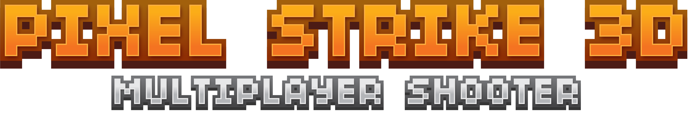

[](#)

[](#)
[](#)


[](#)

# All asset files belong to Pixel Strike 3D


# API Example
Fetch Leaderboards
```python
from apis import PS3D

# Fill in your information accordingly:
player = PS3D(playFabId="...", token="...", device_id="...")

print(player.get_leaderboards())
```
