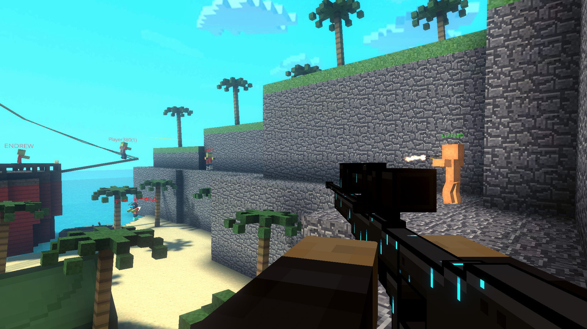

[](#)

[](#)
[](#)


[](#)

# All asset files belong to Pixel Strike 3D


# Archived Source

It is in this repository, just look and you'll find that it's in C++

# Original APIs.py Repository https://github.com/TonicBoomerKewl/pixel-strike-3d-api
Originally Made By TonicBoomerKewl

# API Examples
Fetch Leaderboards
```python
from apis import PS3D

# Fill in your information accordingly:
player = PS3D(playFabId="...", token="...", device_id="...")

print(player.get_leaderboards())
```

Search Clans
```python
from apis import PS3D

# Fill in your information accordingly:
player = PS3D(playFabId="...", token="...", device_id="...")

print(player.search_clans("Example"))
```

Get Clan by ID
```python
from apis import PS3D

# Fill in your information accordingly:
player = PS3D(playFabId="...", token="...", device_id="...")

print(player.get_clan(1))
```

Get Profile by ID
```python
from apis import PS3D

# Fill in your information accordingly:
player = PS3D(playFabId="...", token="...", device_id="...")

print(player.get_profile(1))
```

Follow Player by ID
```python
from apis import PS3D

# Fill in your information accordingly:
player = PS3D(playFabId="...", token="...", device_id="...")

print(player.follow(1))
```

Unfollow Player by ID
```python
from apis import PS3D

# Fill in your information accordingly:
player = PS3D(playFabId="...", token="...", device_id="...")

print(player.unfollow(1))
```

Display Currency
```python
from apis import PS3D

# Fill in your information accordingly:
player = PS3D(playFabId="...", token="...", device_id="...")

print(player.get_currency())
```

[](#)
